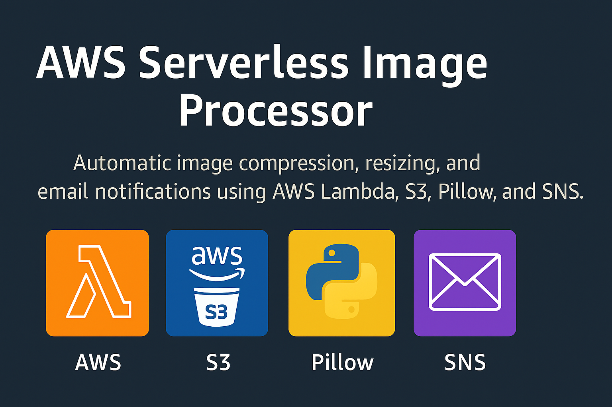
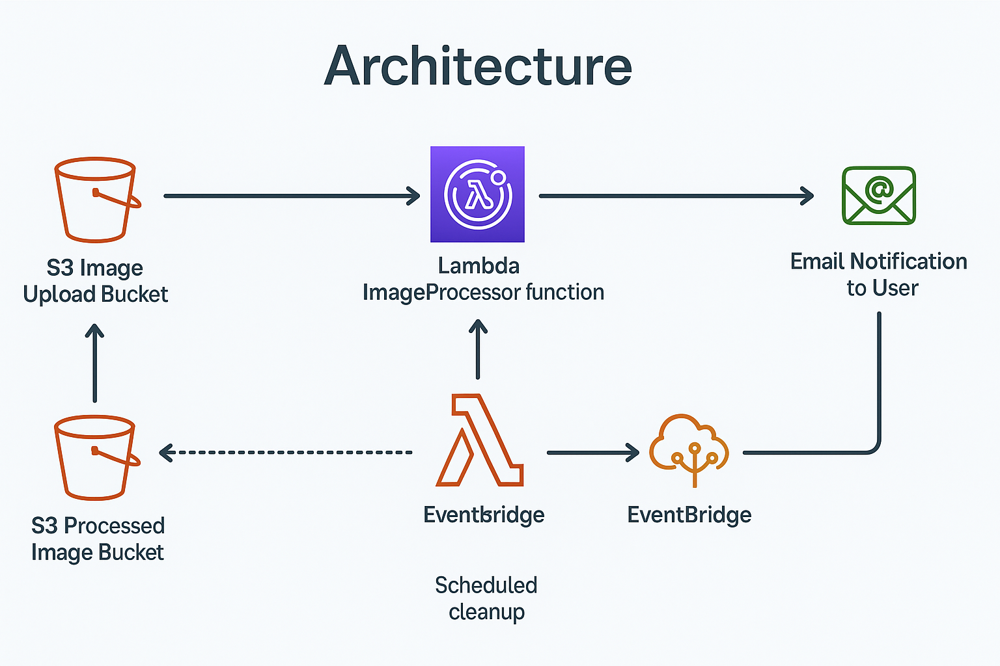

**aws-serverless-image-processor**


# ✅ **1. Folder Structure**

```
aws-serverless-image-processor/
│── lambda/
│   └── image_processor.py
│
│── layers/
│   └── README.md   # (instructions to generate Pillow layer)
│
│── docs/
│   ├── banner.png
│   ├── architecture.png
│   └── screenshots/
│       └── sample_email.png
│
│── .gitignore
│── LICENSE
│── README.md
```

---

# ✅ **2. BANNER IMAGE**

`docs/banner.png`

---

# ✅ **3. Architecture Diagram**

`docs/architecture.png`

---

# 🧠 AWS Serverless Image Processor  
**Automatic image compression, resizing, and email notifications using AWS Lambda, S3, Pillow, and SNS.**

<p align="center">
  
</p>

<p align="center">
  
  
  
  
  
</p>

---

## 📌 Overview

This project automatically processes images uploaded to an S3 bucket.  
When a `.jpg` or `.png` file is uploaded:

1. **S3 triggers Lambda**
2. Lambda loads the image using **Pillow**
3. It **resizes/compresses** the image
4. Stores processed result in a **second S3 bucket**
5. Sends an **SNS email notification**
6. Logs everything in CloudWatch

---

## 🧱 Architecture

<p align="center">
  
</p>

**Flow:**

1. User uploads image → **S3 bucket (imageuploadsiddu)**
2. S3 event triggers → **Lambda function**
3. Lambda uses **Pillow layer** to process image
4. Processed image saved → **processedimagessiddu**
5. SNS sends email → "Image processed successfully"
6. CloudWatch logs store all events

---

## 🚀 Features

✔ Event-driven image processing  
✔ JPG/PNG resize + compression  
✔ SNS email notifications  
✔ Fully serverless architecture  
✔ CloudWatch logging  
✔ Clean repository structure  
✔ Production-ready Lambda code  
✔ Pillow layer support  

---

## 🪜 Deployment Steps

### **1️⃣ Create two S3 buckets**
- `imageuploadsiddu` → input bucket  
- `processedimagessiddu` → output bucket  

---

### **2️⃣ Create SNS Topic**
Name:ImageProcessingNotifications
```

Create **email subscription** → Confirm email.

---

### **3️⃣ Create IAM Role for Lambda**
attach this inline policy 

{
  "Version": "2012-10-17",
  "Statement": [
    {
      "Effect": "Allow",
      "Action": [
        "s3:GetObject",
        "s3:PutObject"
      ],
      "Resource": [
        "arn:aws:s3:::imageuploadsiddu/*",
        "arn:aws:s3:::processedimagessiddu/*"
      ]
    },
    {
      "Effect": "Allow",
      "Action": "sns:Publish",
      "Resource": "*"
    },
    {
      "Effect": "Allow",
      "Action": [
        "logs:CreateLogGroup",
        "logs:CreateLogStream",
        "logs:PutLogEvents"
      ],
      "Resource": "*"
    }
  ]
}


4️⃣ Add Lambda Function

Create Lambda → Python 3.9 → Upload this file:

lambda/image_processor.py

🔥 5️⃣ Creating the Pillow Layer (REQUIRED)
